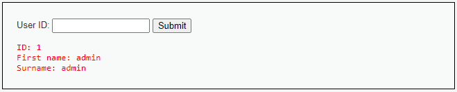
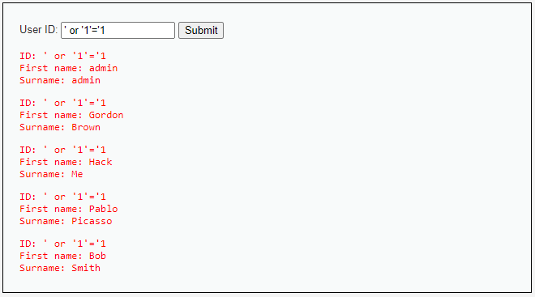
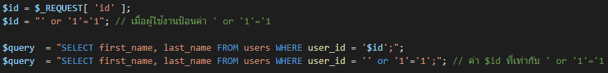
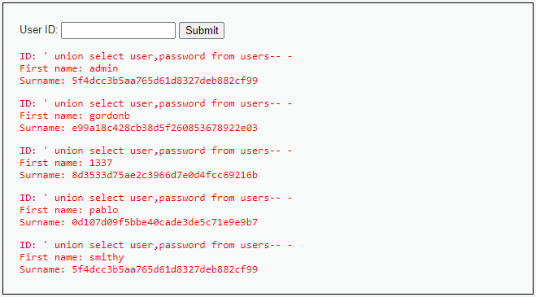

# #Code4Sec #AHICTF


**If you want to succeed, you have to let failure be your *best friend!***

####  AKA "AHI AHI" (อะฮิ อะฮิ)

## การใช้งานฟังก์ชัน mysqli_real_escape_string() ในภาษา PHP

### mysqli_real_escape_string()
mysqli_real_escape_string() เป็นฟังก์ชั่นสำหรับการเปลี่ยนอักขระพิเศษที่ส่งเข้ามาให้กลายเป็นค่า string ซึ่ง Database จะไม่นำอักขระพิเศษนั้น ๆ ไปประมวลผล ซึ่งถ้าหากไม่มีการกรอง หรือเปลี่ยนอักขระพิเศษที่ส่งเข้ามา อาจทำให้เกิดช่องโหว่ SQL Injection

### ตัวอย่างช่องโหว่ SQL Injection ที่เกิดจากการไม่ตรวจสอบข้อมูลนำเข้า

หน้าเว็บนี้ไว้ใช้สำหรับค้นหาชื่อ นามสกุล ของผู้ใช้งานจาก User ID ดังรูปด้านล่าง


ซึ่งหน้าเว็บดังกล่าวไม่มีการใช้งาน ```mysqli_real_escape_string() ``` เราสามารถตรวจสอบได้โดยใส่เครื่องหมาย ```'``` หรือ ```' or '1'='1``` เป็นต้น 


จากรูปด้านบนจะสังเกตเห็นได้ว่าหน้าเว็บมีการนำคำสั่ง ```'``` or ```'1'='1``` ไปทำการประมวลผลด้วย อธิบายการทำงานได้ดังนี้


ซึ่งการประมวลผลนี้จะเป็นจริงเสมอเพราะมี or 1 = 1 ซึ่งเป็นจริง ผู้ไม่หวังดีสามารถใช้ช่องโหว่ดังกล่าวในการดึงข้อมูล Username และ Password ของผู้ใช้งานได้ โดยใส่คำสั่ง ```' union select user,password from users-- -``` เป็นต้น


### วิธีการใช้งาน mysqli_real_escape_string()

